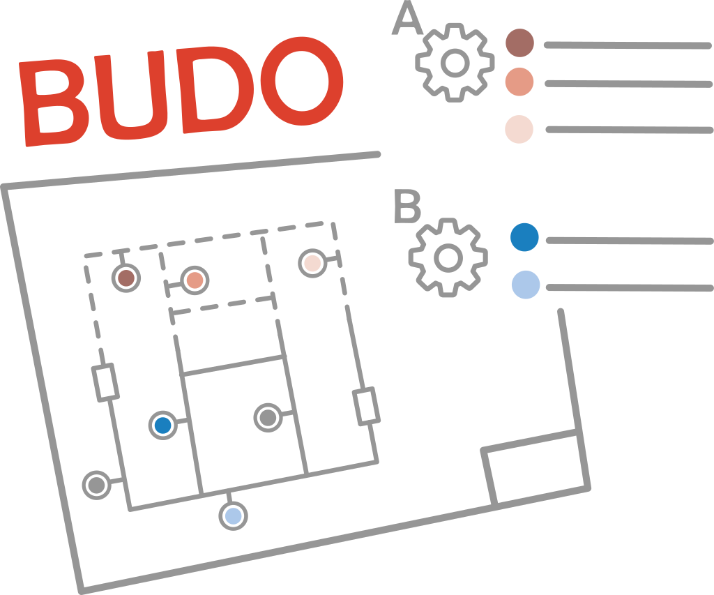
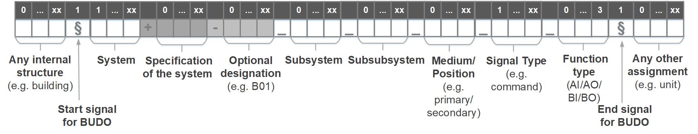

# BUDO

<div class="pull-left">

<p>Buildings Unified Data point naming schema for Operation management</p>

</div>
<div class="pull-right">

</div>

Contact:

[Team BUDO Schema](mailto:info@budo-schema.de)

Building energy systems are often incorrectly controlled and therefore unnecessarily consume too much energy. Especially in non-residential buildings, Building automation systems offer the possibility to influence the control. A distinctive mark for the description of data points is their name. The scheme is often specified by the client or the scheme of the building automation manufacturer is used. In some cases, these are not even named according to a scheme. This individual designation makes it difficult to use automatic algorithms (analysis, error detection, operational management).

A team from E.ON ERC has tackled this problem and developed a standardized method for naming data points. This method is based on a method originally developed at Fraunhofer ISE for the designation of data points. This was further developed by E.ON ERC with the support of Fraunhofer ISE. It is entitled ```Buildings Unified Data point naming schema for Operation management``` (or ```BUDO Schema``` for short) and is specially designed for the demands of energy system analysis and operational management. It can be used in new and existing buildings. This means that developed automated methods can be implemented in both new and existing buildings.

To make this key practical, an easy-to-use Excel tool has been developed. This allows the original name to be inserted and then named using the standardized naming scheme. The individual parts of the data point key can be selected in a dropdown menu and thus the name of a data point can be compiled. The tool can be called up under this [link](https://github.com/RWTH-EBC/BUDO/tree/master/Excel-Table). If you only want to test BUDO, you can use our [Google Spreadsheet](https://docs.google.com/spreadsheets/d/1irBxSYUZWAnswR2uyZlXsgReJTcwf_vETIxmwAzKYMQ/edit#gid=0) version.

# Structure



The structure of the data point is very simple. There is space at the beginning for individual categories. This means that every operator can map his organizational structure in the schema. We have made categories of 40 publicly available standards mapable for the description of building automation data. A user of BUDO can choose which categories are useful for him. Each category can be provided with its own designation. This makes it possible, for example, to map your own building assignments. In the Excel tool, five free categories are displayed for this purpose. However, it is also possible to add further user-specific categories.

This first part is separated from the standardized part of the data point key by a ```§```. Then the categories ```System```, ```Subsystem```, ```Subsubsystem```, ```Medium/Position```, ```Signal type``` and ```Function type``` can be selected. These have several specifications, so that it is possible to select very precisely to which plant and system a data point is assigned, where it is located and what type it represents. Each category has its own abbreviation, so that everyone can see which category is described here.

By selecting optional designations or numbering, the designations used before can be integrated. This means that the individual data points can still be recognized on existing plans. These manual specifications can also be used for the data visualization of customers.

At the end, three more free categories can be added (e.g. unit). These are separated from the rest of the standard by a ```§``` at the beginning.

You can access the Excel BUDO Creator via the following [link](https://github.com/RWTH-EBC/BUDO/tree/master/Excel-Table). A Google Spreadsheet version is for testing available under the following [link](https://docs.google.com/spreadsheets/d/1irBxSYUZWAnswR2uyZlXsgReJTcwf_vETIxmwAzKYMQ/edit#gid=0). If you need a personal version of the Google Spreadsheet version, please contact the [BUDO Schema Team](mailto:info@budo-schema.de). We will provide the spreadsheet very soon.

# Basic principles of BUDO

The vocabularies for BUDO are documented in the following [article](https://github.com/RWTH-EBC/BUDO/wiki/Documentation-BUDO-vocabulary). As the free categories allow to fine granular describe the integration into the operation, we describe in the following [article](https://github.com/RWTH-EBC/BUDO/wiki/Documentation-free-categories) which free categories and which specifications you can use here. The german documentation is mapped [here](https://github.com/RWTH-EBC/BUDO/wiki/Dokumentation-BUDO-Vokabular) and [here](https://github.com/RWTH-EBC/BUDO/wiki/Dokumentation-freie-Kategorien).

# Usage of BUDO Creator

An instruction how to use the BUDO Creator can be found [here](https://github.com/RWTH-EBC/BUDO/wiki/Usage-BUDO-creator).

# Wiki of BUDO Schema

In our [wiki](https://github.com/RWTH-EBC/BUDO/wiki), you can find some tutorials, documentations and recommendations of BUDO.

# Contribute to BUDO Schema

You can contribute to BUDO Schema via a [Github Issue](https://github.com/RWTH-EBC/BUDO/issues). The exact workflow is described [here](https://github.com/RWTH-EBC/BUDO/wiki/GIT-workflow).

# Examples

BUDO offers a description for different technical equipments. How this can be done for example equipments is described in a [Wiki article](https://github.com/RWTH-EBC/BUDO/wiki/Examples-BUDO). The examples are sorted according to the categories of BUDO and the technical equipments.

# Reference

We continuously improve **BUDO** and try to keep the community up-to-date with citable papers. Additional papers for usage, tools and tool chains can be found [here](https://github.com/RWTH-EBC/BUDO/wiki/Papers).

The actual main paper of **BUDO** is the following, but the paper reproduce not the actual status of **BUDO**:

- Structuring building monitoring and automation system data.
  Stinner F., Kornas A., Baranski M., Müller D..
  The REHVA European HVAC Journal, vol. 55, no. 4, pp. 10–15, 2018.
  [Link to PDF File](https://www.rehva.eu/fileadmin/user_upload/10-15_RJ1804_WEB.pdf)

Bibtex:
```
@incollection{Stinner.2018,
 author = {Stinner, Florian and Kornas, Alina and Baranski, Marc and M{\"u}ller, Dirk},
 title = {Structuring building monitoring and automation system data},
 url = {https://www.rehva.eu/fileadmin/user_upload/10-15_RJ1804_WEB.pdf},
 pages = {10--15},
 series = {The REHVA European HVAC Journal},
 editor = {REHVA},
 booktitle = {The REHVA European HVAC Journal - August 2018},
 year = {2018}
}
```

# Acknowledgement

We thank the BMWK (Federal Ministry for Economics and Climate Action) for their financial support,
Contribution numbers 03ET1022A, 03SBE0006A, 03ET1373A.