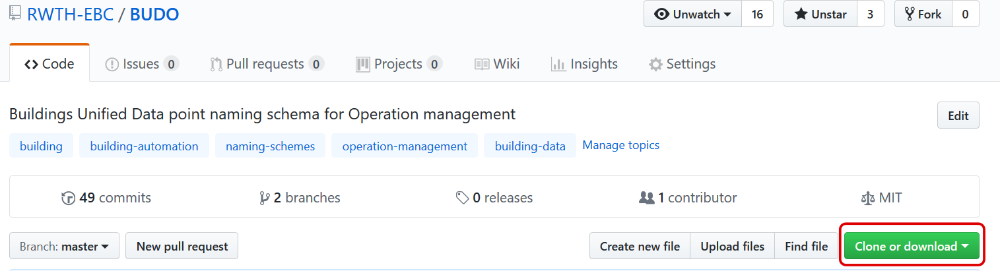
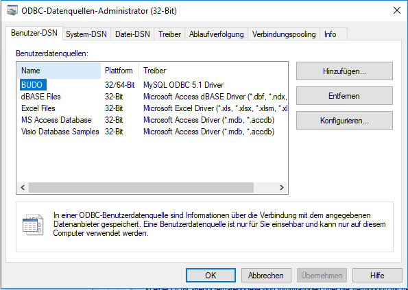
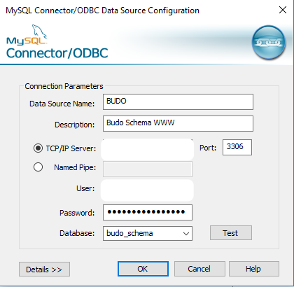
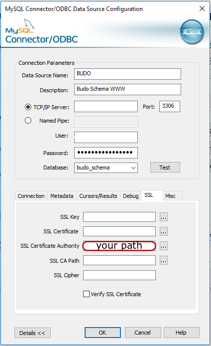
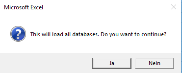
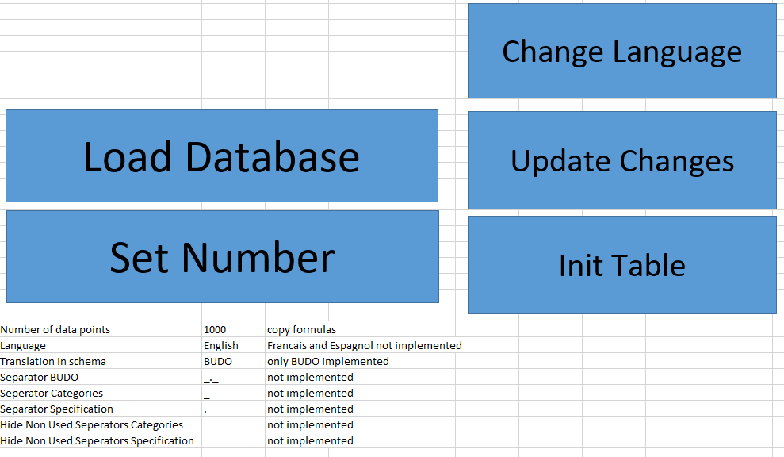

# BUDO
Buildings Unified Data point naming schema for Operation management

Contact:
[Team BUDO Schema](mailto:info@budo-schema.de)

Building energy systems are often incorrectly controlled and therefore unnecessarily consume too much energy. Especially in non-residential buildings, Building automation systems offer the possibility to influence the control. A distinctive mark for the description of data points is their name. The scheme is often specified by the client or the scheme of the building automation manufacturer is used. In some cases, these are not even named according to a scheme. This individual designation makes it difficult to use automatic algorithms (analysis, error detection, operational management).

A team from E.ON ERC has tackled this problem and developed a standardized method for naming data points. This method is based on a method originally developed at Fraunhofer ISE for the designation of data points. This was further developed by E.ON ERC with the support of Fraunhofer ISE. It is entitled "Buildings Unified Data point naming schema for Operation management" (or BUDO Schema for short) and is specially designed for the demands of energy system analysis and operational management. It can be used in new and existing buildings. This means that developed automated methods can be implemented in both new and existing buildings.

To make this key practical, an easy-to-use Excel tool has been developed. This allows the original name to be inserted and then named using the standardized naming scheme. The individual parts of the data point key can be selected in a dropdown menu and thus the name of a data point can be compiled. The tool can be called up under the following link: https://github.com/RWTH-EBC/BUDO/tree/master/Excel-Table.

The structure of the data point is very simple. There is space at the beginning for individual categories. This means that every operator can map his organizational structure in the schema. We have made categories of 40 publicly available standards mapable for the description of building automation data. A user of BUDO can choose which categories are useful for him. Each category can be provided with its own designation. This makes it possible, for example, to map your own building assignments. In the Excel tool, 5 free categories are displayed for this purpose. However, it is also possible to add further user-specific categories. 

This first part is separated from the standardized part of the data point key by a "\_.\_". Then the categories "System", "Subsystem", "Subsubsystem", "Medium/Position", "Signal type" and "Function type" can be selected. These have several specifications, so that it is possible to select very precisely to which plant and system a data point is assigned, where it is located and what type it represents. Each category has its own abbreviation, so that everyone can see which category is described here.

By selecting optional designations or numbering, the designations used before can be integrated. This means that the individual data points can still be recognized on existing plans. These manual specifications can also be used for the data visualization of customers.

At the end, 5 more free categories can be added (e.g. unit). These are separated from the rest of the standard by a "\_.\_" at the beginning.

You can access the BUDO Creator via the following [link](https://github.com/RWTH-EBC/BUDO/tree/master/Excel-Table).


# Basic principles of BUDO


# BUDO Creator

The BUDO Creator allows every user to use the BUDO schema. Here currently existing data points can be renamed or newly created. Before we explain the exact use of the BUDO Creator, we show how the BUDO tool works and how it should be set up before the first use.

The BUDO Creator establishes a database connection that loads the current version of the existing vocabulary. This requires the use of VBA macros. If these are blocked in your organization, only limited usage is possible. In the following, we show the individual steps, which are necessary for the usage of the tool.

## Step 1: Download BUDO Creator
You can download the BUDO Creator Repository via GIT (e.g. with [TortoiseGit](https://tortoisegit.org/)) or as ZIP.



## Step 2: Download MySQL ODBC driver

We use MySQL as database. Download the [MySQL ODBC 5.1 Driver ](https://dev.mysql.com/downloads/connector/odbc/)(IMPORTANT: use 32-bit version, even on a 64-bit operating system). The installation may require a restart.

Install and start the ODBC data source administrator (32-bit version!).



## Step 3: Set database DSN

Use the following connection parameters:

* Data Source Name: BUDO
* port: 3306
* database: budo_schema

The exact server, user and password data can be requested from the [BUDO Schema team](mailto:info@budo-schema.de). You will receive access as soon as possible.



## Step 4: Set up SSL connection

An SSL connection must be set up to ensure secure data transmission. A .pem file with the corresponding key can be found [here](./Resources/SSL/SSL.pem).

The certificate must be stored locally in a `.pem` file.

Under `details` the setting for the `SSL` key can be selected. The path of the SSL file can then be selected under `SSL Certificate Authority`.

The connection can be tested under `Test`. If the test is successful, a window appears with `Connection successful`.



## Step 5: Initialize BUDO Creator

The `Excel-Table` folder contains two Excel tables (`BUDO_Creator_Master.xlsm` and `BUDO_Creator.xlsm`). We recommend to start the user (`BUDO_Creator.xlsm`). This contains all functions of the master. However, this is better organized and for a user, all unnecessary tables are hidden.

When you open the `BUDO_Creator.xlsm`, you will be asked if you want to load the database. This can be helpful when opening the database for the first time. With a click on `yes`, the database is loaded. Caution: this process may take longer.



You start at the `BUDO key` worksheet, where you can create your individual BUDO keys. Let's switch to the `Save` worksheet. Here you can configurate the BUDO Creator. You have five buttons and eight settings (where only three settings are switched active).

First, we explain the individual settings. `Number of data points` sets how many data points should be stored in this table. Set this number as high as possible. A change is only possible in a complicated way.

`Language` changes the Creator language. Currently English and German are implemented as languages. French and Spanish are planned as additional languages. The language of the tool changes immediately when another language is selected.

The default to which the Creator translates can be set under `Translation in schema`. Currently only the BUDO Schema is available. The Creator shall be extended to further schemas (VDI 3814, AMEV, Brick Schema, IFC 4 etc.).

In the following settings, you can set the separators to be used for BUDO, Categories or Specification. This is not yet implemented.

The other settings allow to hide unused categories and not to use them. This is also not implemented yet.

Now we introduce the five buttons. 
`Load Database` loads all vocabulary from our database. This takes a minute or more.

`Set Number` sets the `Number of data points` in the `BUDO key` worksheet. This includes all formulas, that are needed. Caution: Use only at the beginning for initializing. If you use it later, this function overwrites the first `Number of data points` lines.

If you change the the `Language`, the creator changes only the newly added descriptions (e.g. `boiler`). In order to change the already created descriptions into the desired language, the button `Change language` can be pressed. The Creator goes through all lines and changes the language accordingly.

Despite all the development work, names and abbreviations in the BUDO schema also change. To take care of this, the button `Update changes` was introduced. This changes all names to the current standard. So the Creator can be used without hesitation.

The button `Init Table` uses all functions described above one after the other. Here the user always has the possibility to cancel individual functions.

The button `Init Table` uses all functions described above one after the other. Here the user always has the possibility to cancel individual functions. The BUDO Creator goes through the functions in the following order:
* `Load Database`
* `Set number`
* `Update changes`
* `Change Language`




# Usage of BUDO Creator


# Reference

We continuously improve **BUDO** and try to keep the community up-to-date with citable papers:

- Structuring building monitoring and automation system data.
  Stinner F., Kornas A., Baranski M., Müller D..
  The REHVA European HVAC Journal, vol. 55, no. 4, pp. 10–15, 2018.
  [Link to PDF File](https://www.rehva.eu/fileadmin/user_upload/10-15_RJ1804_WEB.pdf)

Bibtex:
```
@incollection{Stinner.2018,
 author = {Stinner, Florian and Kornas, Alina and Baranski, Marc and M{\"u}ller, Dirk},
 title = {Structuring building monitoring and automation system data},
 url = {https://www.rehva.eu/fileadmin/user_upload/10-15_RJ1804_WEB.pdf},
 pages = {10--15},
 series = {The REHVA European HVAC Journal},
 editor = {REHVA},
 booktitle = {The REHVA European HVAC Journal - August 2018},
 year = {2018}
}
```


### Acknowledgement

We thank the BMWi (Federal Ministry of Economics and Energy) for their financial support,
Contribution numbers 03ET1022A, 03SBE0006A, 03ET1373A.